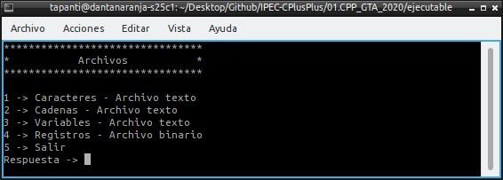
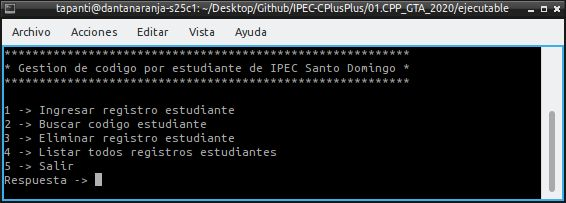
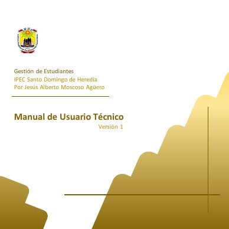
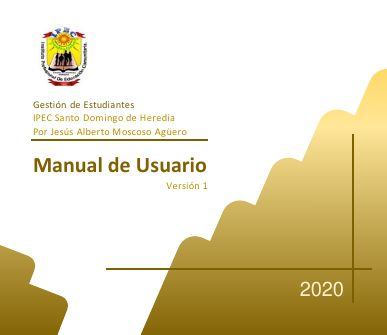
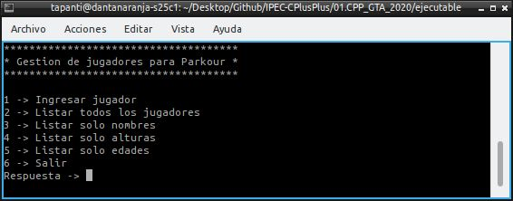

# Algoritmos desarrollados en PSeInt

Instituto Profesional de Educación Comunitaria  
:house: IPEC Santo Domingo de Heredia  
Autor: Jesús Alberto Moscoso Agüero  
:v: J. Mosro  
:email: jmosro.14@gmail.com  
2020-2019  
:costa_rica:  

## [**01.CPP_GTA_2020/**](01.CPP_GTA_2020)

Ejercicios resueltos en lenguaje C++, para trabajo en casa en GTA - Guías de Trabajo Autónomo del 2020. Subárea: Programación, del segundo año. Carrera: Técnico Medio en Informática en Desarrollo de Software.

[**Archivos.cpp**](01.CPP_GTA_2020/Archivos.cpp) :label:  
`Guardar en archivo caracteres, cadenas, variables y registros. Guía de Trabajo Autónomo - GTA.`  

[**EstudiantesIPEC.cpp**](01.CPP_GTA_2020/EstudiantesIPEC.cpp) :label:  
`Gestión de código por estudiante en IPEC Santo Domingo de Heredia. Guía de Trabajo Autónomo - GTA.`  

[**GTA,Manual_Tecnico,EstudiantesIPEC.pdf**](01.CPP_GTA_2020/GTA,Manual_Tecnico,EstudiantesIPEC.pdf) :label:  
`Manual de Usuario Técnico. Versión  1. Gestión  de Estudiantes.`  

[**GTA,Manual_Usuario,EstudiantesIPEC.pdf**](01.CPP_GTA_2020/GTA,Manual_Usuario,EstudiantesIPEC.pdf) :label:  
`Manual de Usuario. Versión  1. Gestión  de Estudiantes.`  

[**ListaDoble.hpp**](01.CPP_GTA_2020/ListaDoble.hpp) :label:  
`Estructura de dato tipo lista enlazada doble.`  

[**Parkour.cpp**](01.CPP_GTA_2020/Parkour.cpp) :label:  
`Gestión de jugadores para Parkour.`  

## [**02.CPP_Proyecto_2019/**](02.CPP_Proyecto_2019)

Proyecto programado de ejercicios resueltos en lenguaje C++, para trabajo en clases del 2019. Subárea: Programación, del primer año. Carrera: Técnico Medio en Informática en Desarrollo de Software.

[**01.NumerosRomanos.cpp**](02.CPP_Proyecto_2019/01.NumerosRomanos.cpp) :label:  
`Convertir un número entero a romano.`  

[**02.RangoEdades.cpp**](02.CPP_Proyecto_2019/02.RangoEdades.cpp) :label:  
`Etapa de la vida según la edad.`  

[**03.TablaMultiplicar.cpp**](02.CPP_Proyecto_2019/03.TablaMultiplicar.cpp) :label:  
`Tabla de multiplicar de un número.`  

[**04.SumaRepetitivaCreciente.cpp**](02.CPP_Proyecto_2019/04.SumaRepetitivaCreciente.cpp) :label:  
`Sumar 1+2+3+..+n Suma repetitiva creciente.`  

[**05.Factorial.cpp**](02.CPP_Proyecto_2019/05.Factorial.cpp) :label:  
`Factorial de número.`  

[**06.SumaRepetitivaPotenciaCreciente.cpp**](02.CPP_Proyecto_2019/06.SumaRepetitivaPotenciaCreciente.cpp) :label:  
`Sumar 2^1+2^2+...+2^n Suma repetitiva potencia creciente.`  

[**07.Fibonacci.cpp**](02.CPP_Proyecto_2019/07.Fibonacci.cpp) :label:  
`Calcular serie fibonacci.`  

[**08.SumaElementosArreglo.cpp**](02.CPP_Proyecto_2019/08.SumaElementosArreglo.cpp) :label:  
`Sumar elementos de un arreglo.`  

[**09.IndiceElementosArreglo.cpp**](02.CPP_Proyecto_2019/09.IndiceElementosArreglo.cpp) :label:  
`Imprimir el elemento del arreglo con su índice.`  

[**10.MayorElementoArreglo.cpp**](02.CPP_Proyecto_2019/10.MayorElementoArreglo.cpp) :label:  
`Calcular el mayor elemento de un arreglo.`  

[**main.cpp**](02.CPP_Proyecto_2019/main.cpp) :label:  
`Archivo principal main().`  

[**Proyecto_Programacion,III_Trimestre,I_Nivel.pdf**](02.CPP_Proyecto_2019/Proyecto_Programacion,III_Trimestre,I_Nivel.pdf) :label:  
`Evaluación Proyecto III Período del 2019`  

## [**03.CPP_Ejercicios_2019/**](03.CPP_Ejercicios_2019)

Ejercicios resueltos en lenguaje C++, para trabajo en clases del 2019. Subárea: Programación, del primer año. Carrera: Técnico Medio en Informática en Desarrollo de Software.

[**01.Multiplicacion2Numeros.cpp**](03.CPP_Ejercicios_2019/01.Multiplicacion2Numeros.cpp) :label:  
`Multiplicación de 2 flotantes.`  

[**02.Sumatoria10Numeros.cpp**](03.CPP_Ejercicios_2019/02.Sumatoria10Numeros.cpp) :label:  
`Sumatoria de 10 números. Mitad con enteros y mitad con flotante.`  

[**03.OperacionesBasicas2Numeros.cpp**](03.CPP_Ejercicios_2019/03.OperacionesBasicas2Numeros.cpp) :label:  
`Suma, resta, multiplicación, división de 2 números.`  

[**04.NumeroEsParImpar.cpp**](03.CPP_Ejercicios_2019/04.NumeroEsParImpar.cpp) :label:  
`Número es par o impar.`  

[**05.DiaSemanaPorNumero.cpp**](03.CPP_Ejercicios_2019/05.DiaSemanaPorNumero.cpp) :label:  
`Día de la semana de acuerdo al número que se ingresa.`  

[**06.MesPorNumero.cpp**](03.CPP_Ejercicios_2019/06.MesPorNumero.cpp) :label:  
`Mes del año de acuerdo al número que se ingresa.`  

[**07.Mayor3Numeros.cpp**](03.CPP_Ejercicios_2019/07.Mayor3Numeros.cpp) :label:  
`Cuál es el mayor de 3 números.`  

[**08.MayorMenor3Numeros.cpp**](03.CPP_Ejercicios_2019/08.MayorMenor3Numeros.cpp) :label:  
`Mayor y menor de 3 números.`  

[**09.Decreciente3Numeros.cpp**](03.CPP_Ejercicios_2019/09.Decreciente3Numeros.cpp) :label:  
`Forma decreciente de 3 números.`  

[**10.DecrecientePorLineaIgual.cpp**](03.CPP_Ejercicios_2019/10.DecrecientePorLineaIgual.cpp) :label:  
`Forma decreciente de 3 números. Si se repiten imprimirlos en la misma línea.`  

[**11.DivisionEnteraYReal.cpp**](03.CPP_Ejercicios_2019/11.DivisionEnteraYReal.cpp) :label:  
`Diferentes tipos de resultado entre división de enteros y reales.`  

[**12.OperadoresAritmeticos.cpp**](03.CPP_Ejercicios_2019/12.OperadoresAritmeticos.cpp) :label:  
`Uso de funciones de otras librerías como operadores aritméticos.`  

[**13.StringConcatenarNombre.cpp**](03.CPP_Ejercicios_2019/13.StringConcatenarNombre.cpp) :label:  
`Concatenar todas las partes del nombre de la persona.`  

[**14.LetraEsVocal.cpp**](03.CPP_Ejercicios_2019/14.LetraEsVocal.cpp) :label:  
`Pedir una letra y decir si es vocal.`  

[**15.MenuOpciones.cpp**](03.CPP_Ejercicios_2019/15.MenuOpciones.cpp) :label:  
`Crear un menú y hasta que elija la opción salir, entonces salir.`  

[**16.MenuPerimetroTriangulo.cpp**](03.CPP_Ejercicios_2019/16.MenuPerimetroTriangulo.cpp) :label:  
`Elegir tipo de triángulo y calcular el perímetro del triángulo.`  

[**17.ConversionKGaCualquierBase.cpp**](03.CPP_Ejercicios_2019/17.ConversionKGaCualquierBase.cpp) :label:  
`Programa para pasar de KG a cualquier unidad de medida.`  

[**18.SalarioAumento.cpp**](03.CPP_Ejercicios_2019/18.SalarioAumento.cpp) :label:  
`Calcular el salario de un trabajor respecto a la cantidad de años laborados en la misma empresa.`  

[**19.SignoZodiacal.cpp**](03.CPP_Ejercicios_2019/19.SignoZodiacal.cpp) :label:  
`Signo zodiacal usando el día y mes de nacimiento.`  

[**20.Calculadora.cpp**](03.CPP_Ejercicios_2019/20.Calculadora.cpp) :label:  
`Calculadora para las operación matemáticas fundamentales.`  

[**21.ValorAbsoluto.cpp**](03.CPP_Ejercicios_2019/21.ValorAbsoluto.cpp) :label:  
`Calcular el valor absoluto.`  

[**22.Calificaciones.cpp**](03.CPP_Ejercicios_2019/22.Calificaciones.cpp) :label:  
`Promedio, máximo y mínimo de calificaciones.`  

[**23.ConjeturaCollatz.cpp**](03.CPP_Ejercicios_2019/23.ConjeturaCollatz.cpp) :label:  
`Calcular la Conjetura de Collatz.`  

[**24.VentaPeliculas.cpp**](03.CPP_Ejercicios_2019/24.VentaPeliculas.cpp) :label:  
`Carrito de compras de películas.`  

## [**04.CPP_Teoria_2019/**](04.CPP_Teoria_2019)

Ejemplo de teoría en lenguaje C++, para trabajo en clases del 2019. Subárea: Programación, del primer año. Carrera: Técnico Medio en Informática en Desarrollo de Software.

[**01.Printf.cpp**](04.CPP_Teoria_2019/01.Printf.cpp) :label:  
`Ejemplo de uso de printf().`  

[**02.Scanf.cpp**](04.CPP_Teoria_2019/02.Scanf.cpp) :label:  
`Ejemplo de uso de scanf().`  

[**03.Funciones.cpp**](04.CPP_Teoria_2019/03.Funciones.cpp) :label:  
`Ejemplo de uso de funciones. Función suma().`  

[**04.HacerComentarios.cpp**](04.CPP_Teoria_2019/04.HacerComentarios.cpp) :label:  
`Ejemplo de uso de comentarios en el código fuente.`  

[**05.ParametrosValor.cpp**](04.CPP_Teoria_2019/05.ParametrosValor.cpp) :label:  
`Ejemplo de paso de parámetros por valor. Función demo().`  

[**06.ParametrosValorConstante.cpp**](04.CPP_Teoria_2019/06.ParametrosValorConstante.cpp) :label:  
`Ejemplo de paso de parámetros por valor constante. Función suma().`  

[**07.ParametrosReferencia.cpp**](04.CPP_Teoria_2019/07.ParametrosReferencia.cpp) :label:  
`Ejemplo de paso de parámetros por referencia. Función intercambio().`  

[**08.CambiosConsola.cpp**](04.CPP_Teoria_2019/08.CambiosConsola.cpp) :label:  
`Ejemplo de cambio de color de la consola.`  

[**09.Librerias.cpp**](04.CPP_Teoria_2019/09.Librerias.cpp) :label:  
`Ejemplo de uso de librerías.`  

[**10.Array.cpp**](04.CPP_Teoria_2019/10.Array.cpp) :label:  
`Ejemplo de uso de array.`  

[**11.ArrayLectura.cpp**](04.CPP_Teoria_2019/11.ArrayLectura.cpp) :label:  
`Ejemplo de lectura de un array.`  

[**12.ArrayEscritura.cpp**](04.CPP_Teoria_2019/12.ArrayEscritura.cpp) :label:  
`Ejemplo de escritura de un array.`  

[**13.Matrices.cpp**](04.CPP_Teoria_2019/13.Matrices.cpp) :label:  
`Ejemplo de uso de matrices.`  

[**14.MatricesParametros.cpp**](04.CPP_Teoria_2019/14.MatricesParametros.cpp) :label:  
`Ejemplo de matriz como parámetro.`  

[**15.PunterosArray.cpp**](04.CPP_Teoria_2019/15.PunterosArray.cpp) :label:  
`Ejemplo de punteros en array.`  

[**16.Constantes.cpp**](04.CPP_Teoria_2019/16.Constantes.cpp) :label:  
`Ejemplo de variable constante, calcular el área de un círculo.`  

[**17.CadenaCopiar.cpp**](04.CPP_Teoria_2019/17.CadenaCopiar.cpp) :label:  
`Ejemplo de copiar una cadena dentro de otra cadena.`  

[**18.ConversionTipos.cpp**](04.CPP_Teoria_2019/18.ConversionTipos.cpp) :label:  
`Convertir un entero a flotante con casting explícito e implícito.`  

[**19.StringBiblioteca.cpp**](04.CPP_Teoria_2019/19.StringBiblioteca.cpp) :label:  
`Ejemplo de uso de funciones de la biblioteca string.h`  

[**20.StrlenCantidadCaracteres.cpp**](04.CPP_Teoria_2019/20.StrlenCantidadCaracteres.cpp) :label:  
`Ejemplo de uso de strlen() de la biblioteca string.h`  

[**21.Estructuras.cpp**](04.CPP_Teoria_2019/21.Estructuras.cpp) :label:  
`Ejemplo de estructuras struct.`  

[**22.EstructurasPunteros.cpp**](04.CPP_Teoria_2019/22.EstructurasPunteros.cpp) :label:  
`Ejemplo de copiar struct por punteros.`  

[**23.EstructurasParametros.cpp**](04.CPP_Teoria_2019/23.EstructurasParametros.cpp) :label:  
`Ejemplo de structuras como parámetro.`  

[**24.EstructurasComoParametrosEjercicio.cpp**](04.CPP_Teoria_2019/24.EstructurasComoParametrosEjercicio.cpp) :label:  
`Ejemplo de estructura como parámetro.`  

[**25.VectoresLeer.cpp**](04.CPP_Teoria_2019/25.VectoresLeer.cpp) :label:  
`Ejemplo de leer un vector como parámetro. Función leerVector().`  

[**26.VectoresCopiar.cpp**](04.CPP_Teoria_2019/26.VectoresCopiar.cpp) :label:  
`Ejemplo de copiar vectores.`  

[**27.VectoresParametros.cpp**](04.CPP_Teoria_2019/27.VectoresParametros.cpp) :label:  
`Ejemplo de vectores como parámetros. Función leerVector().`  

[**28.Punteros1.cpp**](04.CPP_Teoria_2019/28.Punteros1.cpp) :label:  
`Ejemplo de uso de punteros1.`  

[**29.Punteros2.cpp**](04.CPP_Teoria_2019/29.Punteros2.cpp) :label:  
`Ejemplo de uso de punteros2.`  

---
